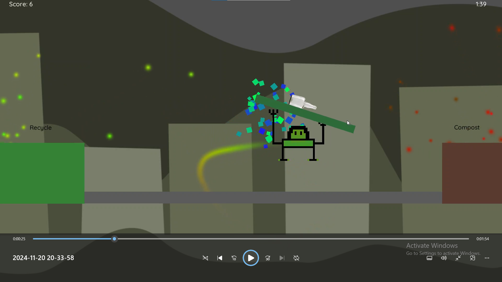
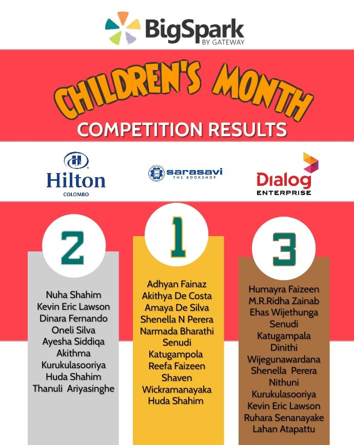

# Bouncy Trash

- Made for a coding challenge hosted by Bigspark in partnership with Dialog and Hilton Hotels. The main aim of the game if to sort random discarded item into recyling and compost bins based on the nature of the waste. The game ended up being first in the category.

